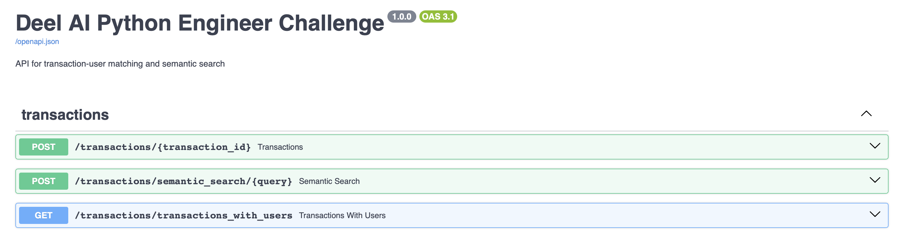
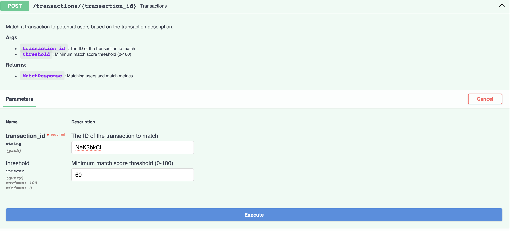
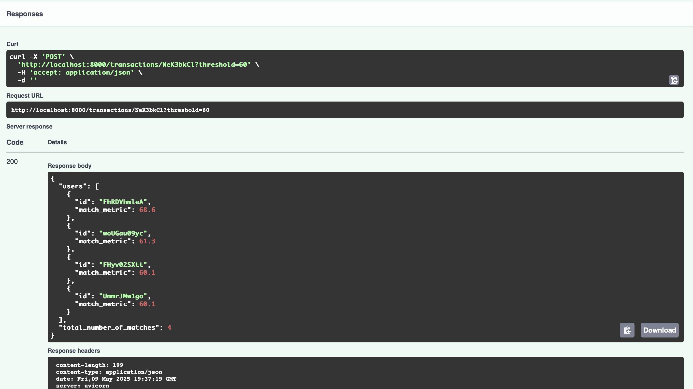
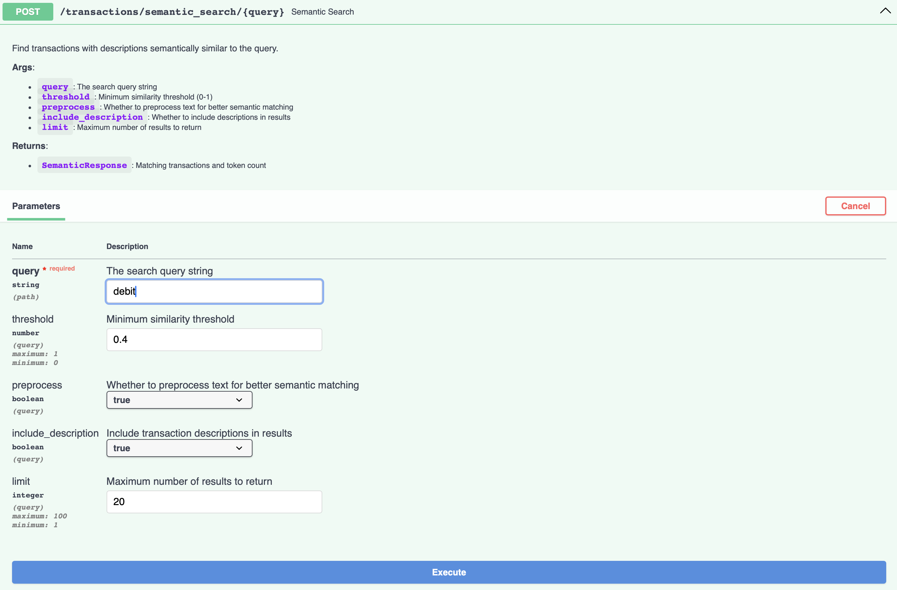
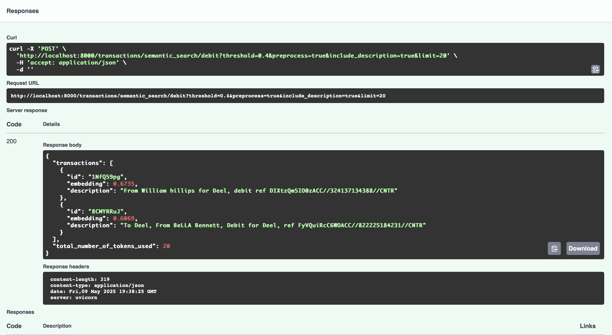
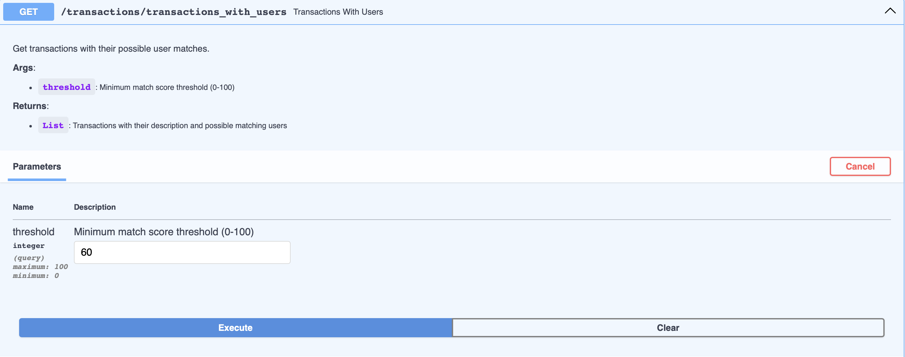
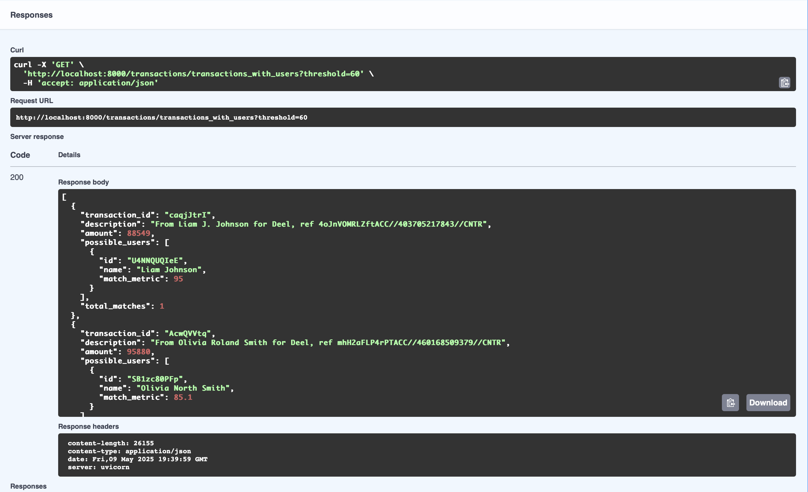

# Deel AI Python Engineer Challenge

This repository contains the implementation of the Deel AI Python Engineer Challenge, a solution for improving payment transaction automation through advanced text processing techniques.

## 📖 Table of Contents

- [Overview](#overview)
- [Project Structure](#project-structure)
- [Technology Stack](#technology-stack)
- [Installation and Setup](#installation-and-setup)
- [API Endpoints](#api-endpoints)
- [Task Solutions](#task-solutions)
  - [Task 1: User-Transaction Matching](#task-1-user-transaction-matching)
  - [Task 2: Semantic Search](#task-2-semantic-search)
  - [Task 3: Production Considerations](#task-3-production-considerations)
- [Architecture Overview](#architecture-overview)
- [Methodology and Design Choices](#methodology-and-design-choices)
- [Unit Tests](#unit-tests)
- [Limitations and Future Improvements](#limitations-and-future-improvements)
- [Conclusion](#conclusion)

## Overview

Deel handles millions of payment transactions monthly, relying on transaction description fields for payment handling and automation. This project addresses recent changes in the way these description fields are populated by implementing advanced text processing solutions.

The solution consists of:
1. A matching system that connects transactions with potential users based on name extraction from transaction descriptions
2. A semantic search engine that finds transactions with descriptions semantically similar to input queries
3. Recommendations for productionizing the system

## Project Structure

```
deel-ai-challenge/
├── data/                      # Data directory for CSV files
│   ├── transactions.csv       # Transaction data
│   └── users.csv              # User data
├── src/                       # Source code
│   ├── api/                   # API endpoints and models
│   │   ├── services/          # Business logic for API endpoints
│   │   │   ├── search_service.py     # Service for semantic search operations
│   │   │   └── transaction_service.py # Service for transaction operations
│   │   ├── app.py             # FastAPI application setup
│   │   ├── endpoints.py       # API endpoint definitions
│   │   └── models.py          # Pydantic models for API schemas
│   ├── core/                  # Core utilities and configuration
│   │   ├── config.py          # Application configuration
│   │   └── utils.py           # Shared utility functions
│   ├── data/                  # Data handling modules
│   │   └── loader.py          # CSV data loading and processing
│   └── services/              # Business logic services
│       ├── matching.py        # User matching implementation (Task 1)
│       └── semantic_search.py # Semantic search implementation (Task 2)
├── tests/                     # Unit and integration tests
│   ├── conftest.py            # Test fixtures and configuration
│   ├── test_apis.py           # API integration tests
│   └── test_services.py       # Service unit tests
├── main.py                    # Main entry point
├── requirements.txt           # Python dependencies
├── run.sh                     # Setup and execution script
├── run_tests.sh               # Test execution script
└── README.md                  # This documentation
```

## Technology Stack

I carefully selected the following technologies based on the requirements:

- **FastAPI**: A modern, fast web framework for building APIs with Python, offering automatic Swagger documentation, async support, and type validation through Pydantic.
- **Pandas**: Used for efficient data loading and manipulation of the CSV files.
- **Sentence-Transformers**: Provides pre-trained models for generating high-quality text embeddings for semantic search.
- **FuzzyWuzzy**: Implements fuzzy string matching with Levenshtein Distance to handle typos and inexact matches.
- **Python-Levenshtein**: A C extension for faster Levenshtein distance calculations.
- **Uvicorn**: ASGI server for serving the FastAPI application.
- **HuggingFace Transformers**: For accessing state-of-the-art NLP models.
- **PyTorch**: Required as a backend for the transformer models.

## Installation and Setup

### Prerequisites

- Python 3.8 or higher
- pip (Python package installer)

### Steps to Run

1. Unzip the folder and navigate to the project:
   ```bash
   cd deel-ai-challenge
   ```

2. Run the setup script:
   ```bash
   chmod +x run.sh
   ./run.sh
   ```

   This script will:
   - Create a Python virtual environment
   - Install all required dependencies
   - Set up the data directory
   - Start the application

3. Alternatively, you can set up manually:
   ```bash
   # Create and activate virtual environment
   python3 -m venv venv
   source venv/bin/activate  # On Windows: venv\Scripts\activate
   
   # Install dependencies
   pip install -r requirements.txt
   
   # Run the application
   python main.py
   ```

4. The API will be available at http://localhost:8000/docs for interactive Swagger documentation.

## API Endpoints



### 1. Transaction-User Matching Endpoint
```
POST /transactions/{transaction_id}
```
- **Description**: Takes a transaction ID as input and returns users that match the transaction based on description text
- **Parameters**:
  - `transaction_id` (path): The ID of the transaction to match
  - `threshold` (int, optional): Minimum match score threshold (0-100), default: 60
- **Response**: JSON with matching users sorted by relevance and total match count

#### POST /transactions/{transaction_id} - Request



#### POST /transactions/{transaction_id} - Response



### 2. Semantic Search Endpoint
```
POST /transactions/semantic_search/{query}
```
- **Description**: Takes a string as input and returns transactions with semantically similar descriptions
- **Parameters**:
  - `query` (path): The search query string
  - `threshold` (int, optional): Minimum similarity threshold (0-1), default: 0.4
  - `preprocess` (boolean, optional): Whether to preprocess text for better matching, default: true
  - `include_description` (boolean, optional): Include transaction descriptions in results, default: true
  - `limit` (int, optional): Maximum number of results to return, default: 20
- **Response**: JSON with matching transactions sorted by relevance and total token count

#### POST /transactions/semantic_search/{query} - Request



#### POST /transactions/semantic_search/{query} - Response




### 3. Transactions with Users Endpoint
```
GET /transactions/transactions_with_users
```
- **Description**: Gets all transactions with their possible user matches
- **Parameters**:
  - `threshold` (int, optional): Minimum match score threshold (0-100), default: 60
- **Response**: List of transactions with their descriptions and possible matching users

#### GET /transactions/transactions_with_users - Request



#### GET /transactions/transactions_with_users - Response




## Task Solutions

### Task 1: User-Transaction Matching

#### Approach

The solution extracts potential name candidates from transaction descriptions using a combination of techniques:

1. **Pattern-based name extraction**:
   - Multiple regex patterns to identify names in different formats (e.g., "From X for Deel", "Transfer from X")
   - Special handling for different transaction formats and edge cases
   
2. **Fuzzy matching with user names**:
   - Normalization of text (removing accents, special characters, extra spaces)
   - Multi-part name handling to match first, middle, and last names independently
   - Run-together name detection for names without spaces
   
3. **Scoring system**:
   - Overall text similarity using token-based metrics (20%)
   - Name part matching with position-based weights (first name: 25%, middle name: 3%, last name: 30%)
   - Coverage score based on matched parts (20%)
   - Adjustments for partial/complete matches

#### Limitations

- **Complex name variations**: Although the solution handles many name formats, extremely unusual name variations may be missed
- **Multiple names in descriptions**: When a transaction contains multiple names, the system might not always identify the correct primary name
- **Language-specific naming patterns**: While the solution handles Latin characters with accents, it might not perform as well with other writing systems
- **Computational complexity**: The matching algorithm scales linearly with the number of users and transactions, which could become a bottleneck with large datasets

### Task 2: Semantic Search

#### Approach

The semantic search implementation uses transformer-based embeddings to find transactions with similar semantic meaning:

1. **Text preprocessing**:
   - Normalization of text
   - Focus on key semantic parts (financial terms, parties, actions)
   - Removal of reference numbers and non-semantic elements
   
2. **Embedding generation**:
   - Using Sentence-Transformers with the "all-MiniLM-L6-v2" model
   - Caching of embeddings for efficiency
   - Token count tracking for API response
   
3. **Similarity computation**:
   - Cosine similarity between query and transaction embeddings
   - Threshold filtering to include only relevant matches
   - Sorting by similarity score for relevance ranking

#### Limitations

- **Model understanding**: The embedding model may not fully understand domain-specific financial terminology or abbreviations
- **Context limitations**: The model doesn't consider transaction history or user relationships, only the text content
- **Fixed embedding size**: Using a single model with fixed embedding dimensions may not capture all semantic nuances
- **Token limitation**: The model has token limits for input text, which may affect very long descriptions
- **Language bias**: Pre-trained models may perform better on English text than on text in other languages
- **Description content**: Descriptions mostly contain encrypted set of characters and names which are not ideal for semantic analysis

### Task 3: Production Considerations

To take this proof of concept to production, I recommend the following improvements:

#### Architecture Enhancements

1. **Scalability**:
   - Implement a distributed architecture using microservices
   - Use containerization (Docker) for consistent deployment
   - Deploy on Kubernetes for orchestration and auto-scaling
   - Implement a load balancer for traffic distribution

2. **Performance Optimization**:
   - Add a caching layer (Redis/Memcached) for frequently accessed data
   - Implement database indexing for faster queries
   - Batch processing for large data volumes
   - Use of vector databases (like Pinecone or Milvus) for efficient similarity searches

3. **Data Storage and Processing**:
   - Move from CSV files to a proper database system (PostgreSQL with JSON capabilities)
   - Implement data partitioning for handling large transaction volumes
   - Create a dedicated ETL pipeline for data preprocessing

#### Operational Concerns

1. **Security**:
   - Implement proper authentication and authorization (OAuth, JWT)
   - Add API rate limiting and request validation
   - Encrypt sensitive data in transit and at rest
   - Implement security scanning in CI/CD pipeline

2. **Monitoring and Maintenance**:
   - Set up comprehensive logging and monitoring (ELK stack, Prometheus)
   - Implement alerting for system issues
   - Create automated testing (unit, integration, performance)
   - Develop a model retraining pipeline

3. **Compliance**:
   - Add audit trails for all transactions and matches
   - Implement data retention policies
   - Ensure GDPR and financial regulation compliance
   - Create data lineage tracking

## Architecture Overview

The application follows a layered architecture pattern that separates concerns and ensures maintainability:

```
┌─────────────────────────────────────────────────────────────────┐
│                           Client                                │
└───────────────────────────────┬▲────────────────────────────────┘
                                ││
                                ││
                                ││
┌───────────────────────────────▼│────────────────────────────────┐
│                      FastAPI Application                        │
│  ┌─────────────────────────────────────────────────────────┐    │
│  │                      API Endpoints                      │    │
│  │    (transactions/{id}, semantic_search/{query}, etc)    │    │
│  └──────────────────────────┬▲─────────────────────────────┘    │
│                             ││                                  │
│                             ▼│                                  │
│  ┌─────────────────────────────────────────────────────────┐    │
│  │                     API Services                        │    │
│  │       (TransactionService, SearchService)               │    │
│  └──────────────────────────▲┬─────────────────────────────┘    │
└─────────────────────────────┼┼─────────────────────────────────-┘
                              ││
                              │▼
┌──────────────────────────────────────────────────────────────┐
│                                                              │
│  ┌─────────────────────┐          ┌─────────────────────┐    │
│  │                     │◄───────-►│                     │    │
│  │    DataLoader       │◄────────►│   Core Services     │    │
│  │                     │          │                     │    │
│  └─────────┬▲──────────┘          └──────────┬▲─────────┘    │
│            ││                                ││              │
│            ││                                ││              │
│            ││                      ┌─────────▼│────────--┐   │
│            ││                      │                     │   │
│            ││                      │  ┌─────────────────┐│   │
│            ││                      │  │  UserMatcher    ││   │
│            ││                      │  │    (Task 1)     ││   │
│            ││                      │  └─────────────────┘│   │
│            ││                      │                     │   │
│            ││                      │  ┌─────────────────┐│   │
│            ││                      │  │ SemanticSearch  ││   │
│            ││                      │  │    (Task 2)     ││   │
│            ││                      │  └─────────────────┘│   │
│            ││                      └─────────────────────┘   │
│            ││                                                │  
└────────────┼┼────────────────────────────────────────────────┘
             ││
             ││
┌────────────▼┼───────────────────────────────────────────────────┐
│                                                                 │
│                        Data Sources                             │
│                                                                 │
│            transactions.csv       users.csv                     │
│                                                                 │
└─────────────────────────────────────────────────────────────────┘

```

### Data Flow

1. **Client Request**: Client sends HTTP requests to one of the API endpoints
2. **API Endpoint Processing**: The FastAPI endpoint validates the request using Pydantic models
3. **API Service Orchestration**: The relevant API service (TransactionService or SearchService) coordinates the request processing
4. **Core Services**:
   - For user matching (Task 1): UserMatcher extracts names from transaction descriptions and matches them to users
   - For semantic search (Task 2): SemanticSearchEngine creates embeddings and finds similar transactions
5. **Data Access**: The DataLoader provides access to the transaction and user data
6. **Response Generation**: Results are transformed back into API response models and returned to the client

### Key Components

- **FastAPI Endpoints**: Entry points for HTTP requests, handling parameter validation and response formatting
- **API Services**: Business logic specific to API operations, orchestrating the use of core services
- **UserMatcher**: Implementation of name extraction and fuzzy matching algorithms
- **SemanticSearchEngine**: Implementation of embedding generation and similarity search
- **DataLoader**: Data access layer responsible for loading and caching CSV data
- **Pydantic Models**: Data validation and serialization for API requests and responses

This architecture enables separation of concerns, making the system more maintainable and testable. It also provides clear boundaries between the different functional areas of the application.

## Methodology and Design Choices

### Overall Architecture

The solution follows a layered architecture pattern:

1. **API Layer**: FastAPI endpoints that handle HTTP requests and responses
2. **Service Layer**: Business logic components that implement the core functionality
3. **Data Layer**: Data access components for loading and processing CSV files

This separation of concerns enhances maintainability and allows for independent testing and development of each layer.

### Design Patterns

- **Repository Pattern**: The `DataLoader` class abstracts data access, making it easier to swap out data sources
- **Service Pattern**: Complex business logic is encapsulated in service classes
- **Factory Pattern**: Used for creating API instances in `app.py`
- **Facade Pattern**: The API endpoints provide a simplified interface to the complex subsystems

## Unit Tests

The project includes a comprehensive set of unit and integration tests to ensure the correctness of the implementation:

### Test Coverage

- **Service Unit Tests**: Tests for core business logic components:
  - `UserMatcher`: Tests name extraction, text normalization, and matching algorithms
  - `SemanticSearchEngine`: Tests preprocessing, embedding generation, and similarity calculations
  - `DataLoader`: Tests data loading and retrieval operations

- **API Integration Tests**: Tests for API endpoints and their integration with services:
  - Transaction-User matching endpoint
  - Semantic search endpoint
  - Transactions with users endpoint

### Running Tests

To run the tests, use the provided test script:

```bash
chmod +x run_tests.sh
./run_tests.sh
```

This script will:
- Set up the test environment
- Run unit tests for services
- Run integration tests for APIs
- Report test results

## Limitations and Future Improvements

### Current Limitations

1. **Data handling**:
   - The solution works with static CSV files, which limits real-time updates
   - No handling of very large datasets that don't fit in memory

2. **Algorithm limitations**:
   - The name extraction relies heavily on pattern matching, which may miss unusual formats
   - Semantic search uses a general-purpose model, not optimized for financial text

3. **Operational constraints**:
   - No authentication or authorization
   - Limited error handling for edge cases
   - No persistent storage for embeddings or match results

### Future Improvements

1. **Short-term improvements**:
   - Improve unit and integration tests
   - Implement basic authentication
   - Add more data validation and edge case handling
   - Enhance documentation with more examples

2. **Medium-term improvements**:
   - Implement a proper database backend
   - Add batch processing capabilities

3. **Long-term vision**:
   - Build a complete transaction processing pipeline
   - Implement automated feedback loops for continuous improvement

## Conclusion

This implementation provides a robust solution for matching transactions with users and finding semantically similar transactions. The code is designed with clean architecture principles, allowing for easy extension and maintenance.

The solution strikes a balance between accuracy and performance, using modern NLP techniques while remaining practical for real-world use. While there are limitations to the current implementation, the foundation is solid and can be extended to a production-ready system with the suggested improvements.

By focusing on both pattern-based matching and semantic understanding, the solution offers a comprehensive approach to the transaction description processing challenge.
